# TP1DPBO2425C1 – Sistem Toko Elektronik

## Janji
Saya **Harri Supriadi** dengan **NIM 2405547** mengerjakan TP1 dalam mata kuliah **Desain dan Pemrograman Berorientasi Objek**. Demi keberkahan-Nya, saya menyatakan **tidak melakukan kecurangan** sebagaimana yang telah dispesifikasikan.  
_Aamiin._

---

## 📌 Deskripsi Program
Program ini adalah **sistem manajemen toko elektronik** yang dibuat dengan menerapkan konsep **Object-Oriented Programming (OOP)** dalam **4 bahasa pemrograman**:  

- Java  
- Python  
- C++  
- PHP (Web Version)  

Program ini mengelola data produk elektronik dengan operasi **CRUD** (Create, Read, Update, Delete) menggunakan **array/list of objects**.

---

## 🏗️ Desain Class

### Class `Elektronik`
Merepresentasikan produk elektronik.  

**Atribut:**
- `nama` (String) → Nama produk (contoh: "Laptop", "HP Android")  
- `merk` (String) → Merek/brand produk (contoh: "ASUS", "Samsung")  
- `harga` (Double/Float) → Harga produk (Rp)  
- `stok` (Integer) → Jumlah stok tersedia  

**Method:**
- `Constructor` → Inisialisasi objek dengan 4 parameter  
- Getter: `getNama()`, `getMerk()`, `getHarga()`, `getStok()`  
- Setter: `setNama()`, `setMerk()`, `setHarga()`, `setStok()`  
- `tampilkanInfo()` → Menampilkan informasi elektronik (CLI version)  
- `toArray()` & `fromArray()` → Konversi penyimpanan session (PHP version)  

---

### Class `TokoElektronik`
Mengelola koleksi objek `Elektronik`.  

**Atribut:**
- `daftarElektronik` → Array/List of Objects  

**Method:**
- `tambahElektronik()` → Tambah data elektronik baru  
- `tampilkanSemuaElektronik()` → Menampilkan semua data  
- `editElektronik()` → Edit data berdasarkan index  
- `hapusElektronik()` → Hapus data berdasarkan index  
- `jalankan()` → Method utama (CLI version)  
- `saveToSession()` & `loadFromSession()` → Persistensi data (PHP version)  

---

## ⚙️ Implementasi per Bahasa

### CLI Version (Java, Python, C++)
- Antarmuka berbasis **console/terminal**  
- Menu pilihan CRUD  
- Input: `Scanner` / `input()` / `cin`  
- Output: Tabel di terminal  
- Data: **Array/List/Vector of Objects**  
- Program berjalan dalam loop hingga user keluar  

### Web Version (PHP)
- Antarmuka berbasis **HTML + PHP**  
- Data disimpan dalam **PHP Session**  
- Operasi CRUD menggunakan form & POST method  
- Fitur:
  - Form tambah data
  - Tabel data produk
  - Edit/Hapus data per row
  - Dynamic form edit (JavaScript)
  - Server-side validation  

---

## 🔄 Flow Program

### CLI Version
1. Inisialisasi `TokoElektronik` + tambah 4 data awal  
2. Loop Menu (Create, Read, Update, Delete, Exit)  
3. Validasi input & error handling  

### PHP Web Version
1. Load data dari session (jika kosong → inisialisasi 4 data awal)  
2. Form submit via POST  
3. Operasi CRUD dengan update session  
4. Data ditampilkan dalam tabel HTML  

---

## 🧩 Konsep OOP yang Digunakan
- **Class & Object** → `Elektronik` sebagai blueprint, multi-instance  
- **Encapsulation** → Atribut private, akses via getter/setter  
- **Array/List of Objects** → Manajemen koleksi produk  

---

## Dokumentasi Output

### 1. Java Output

#### Menu dan Tampilan Awal
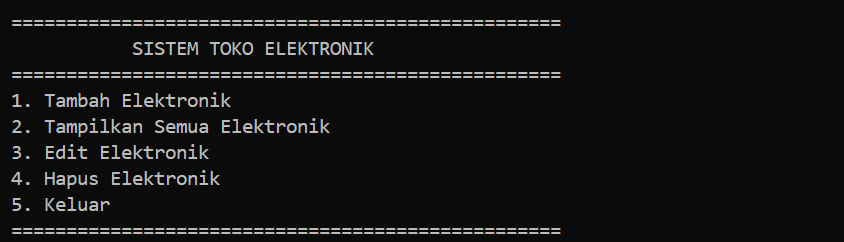

#### Proses Compile dan Jalankan Program
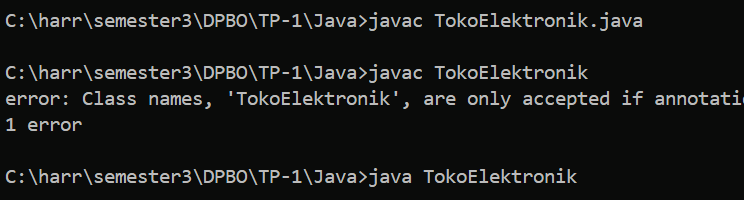

#### Operasi CRUD - Create (Tambah Data)
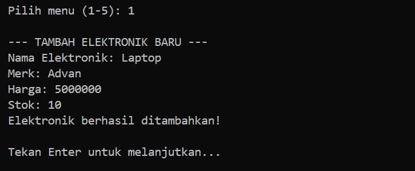

#### Operasi CRUD - Read (Tampilkan Data)
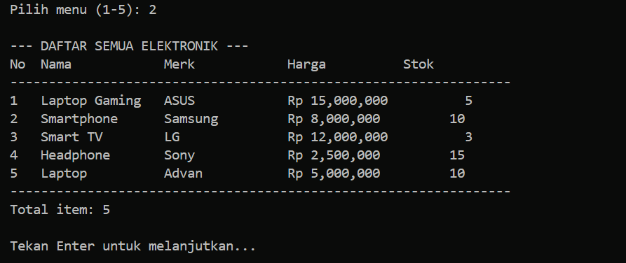

#### Operasi CRUD - Update (Edit Data)
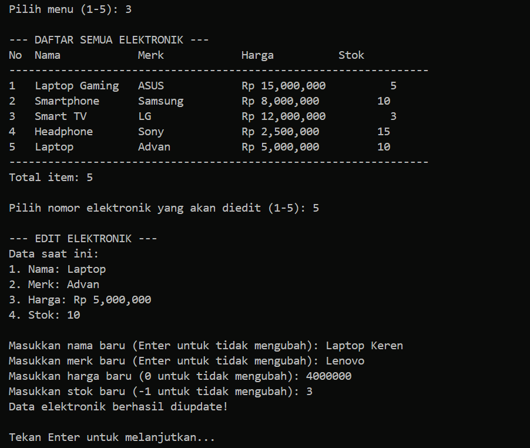

#### Operasi CRUD - Delete (Hapus Data)
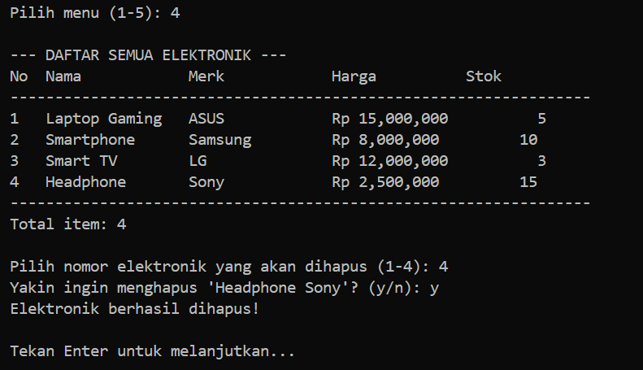

Program Java menampilkan menu console dengan 5 pilihan. User dapat menambah, melihat, edit, dan hapus data elektronik. Data disimpan dalam ArrayList<Elektronik> dan ditampilkan dalam format tabel yang rapi di terminal.

### 2. Python Output

#### Menu dan Tampilan Awal  

#### Operasi CRUD - Create (Tambah Data)
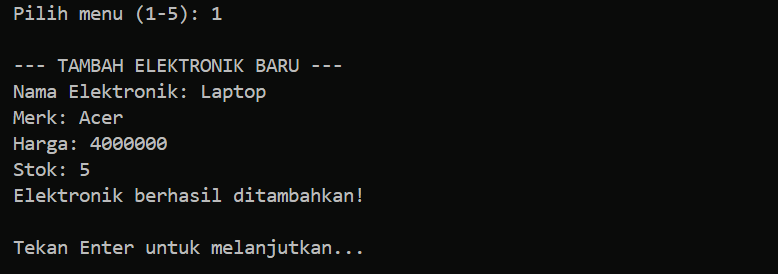

#### Operasi CRUD - Read (Tampilkan Data)
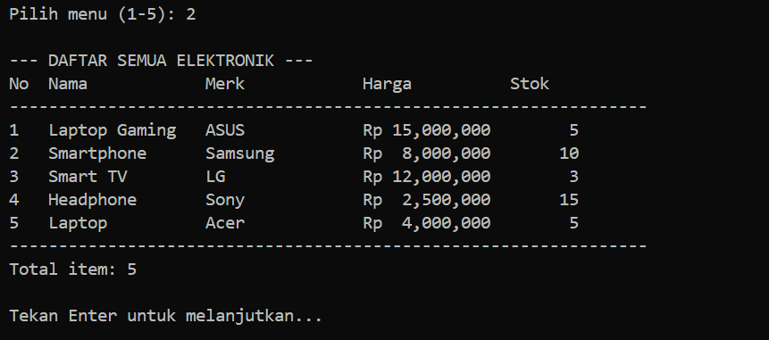

#### Operasi CRUD - Update (Edit Data)
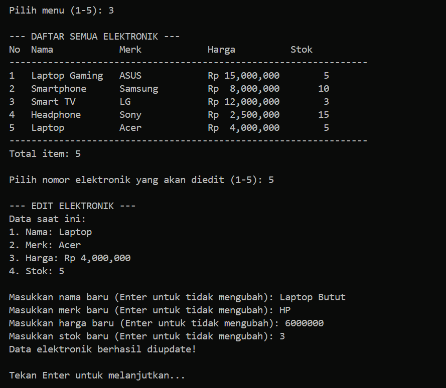

#### Operasi CRUD - Delete (Hapus Data)
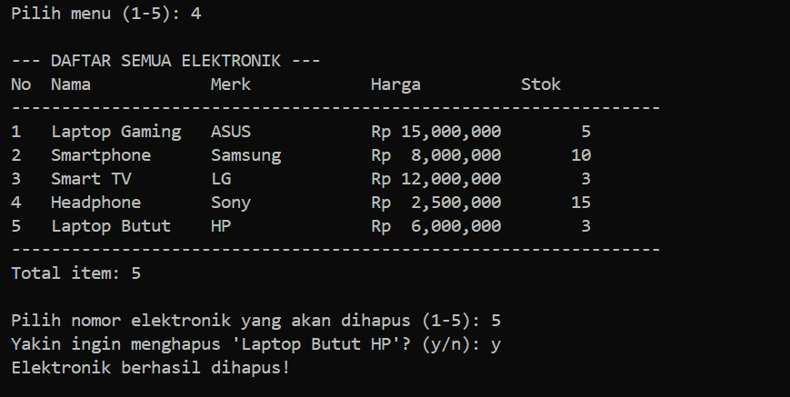

Program Python mengimplementasikan class yang sama dengan interface console. Menggunakan list untuk menyimpan objects dan menyediakan validasi input yang baik dengan exception handling.

### 3. C++ Output

#### Menu dan Tampilan Awal
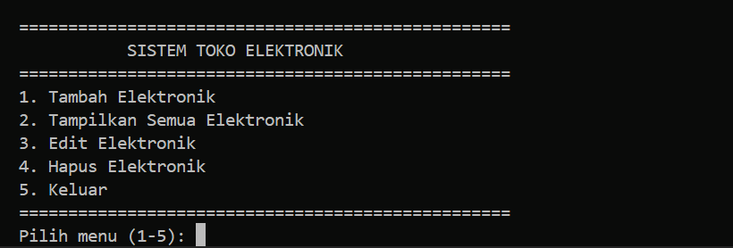

#### Proses Compile dan Jalankan Program
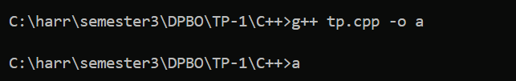

#### Operasi CRUD - Create (Tambah Data)
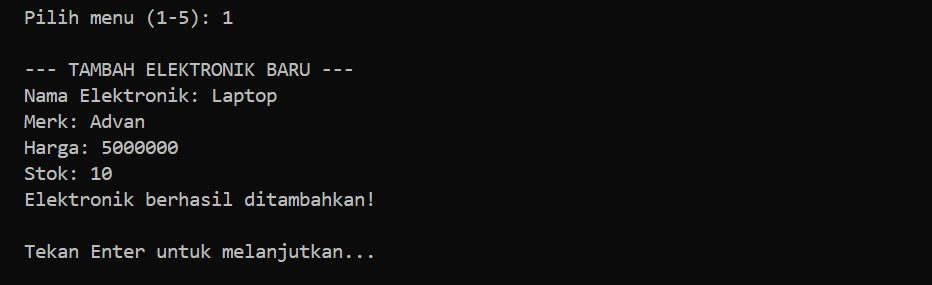

#### Operasi CRUD - Read (Tampilkan Data)
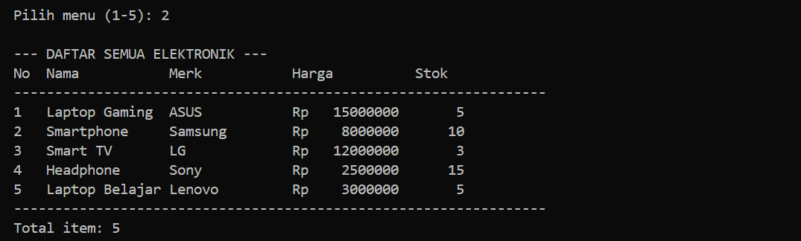

#### Operasi CRUD - Update (Edit Data)

#### Operasi CRUD - Delete (Hapus Data)
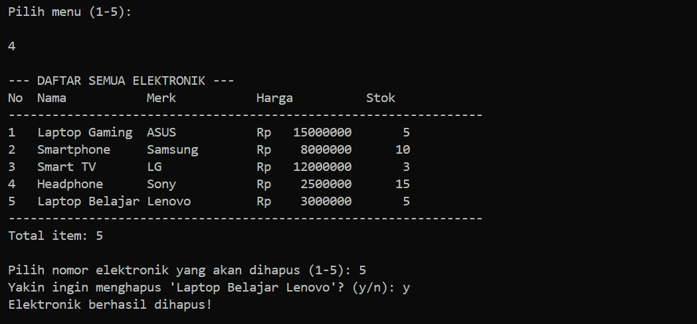

Program C++ menggunakan vector<Elektronik> untuk menyimpan objects. Interface console dengan menu yang user-friendly dan validasi input menggunakan while loop.

### 4. PHP Web Output

#### Operasi CRUD - Create (Tambah Data)
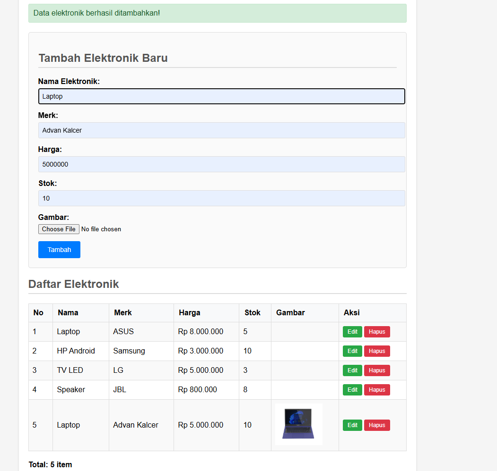

#### Operasi CRUD - Read (Tampilkan Data)
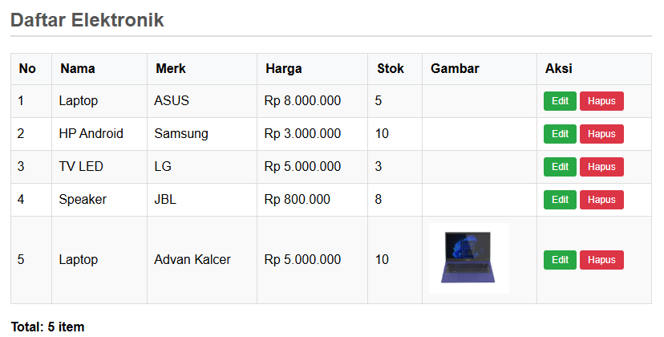

#### Operasi CRUD - Update (Edit Data)
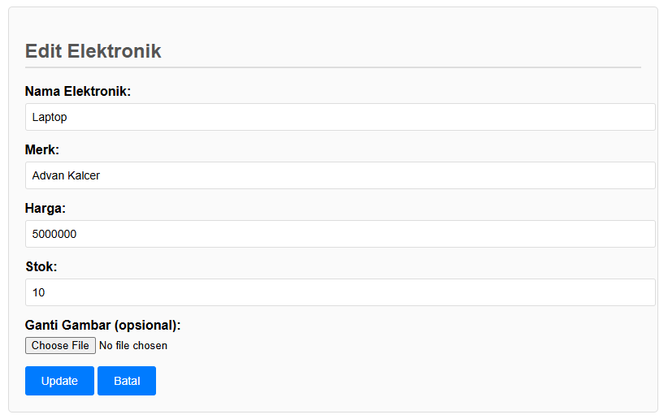

#### Operasi CRUD - Delete (Hapus Data)
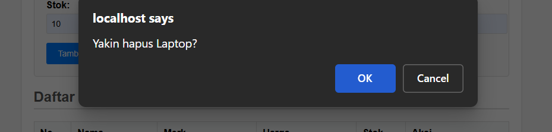

Program PHP Web menampilkan interface HTML dengan form input dan table output. Menggunakan session untuk menyimpan array of objects. Features:
- HTML form untuk input data baru
- HTML table untuk menampilkan semua objects
- Button edit/hapus per item dengan JavaScript
- Form edit yang muncul dynamically
- Server-side validation dan error handling
